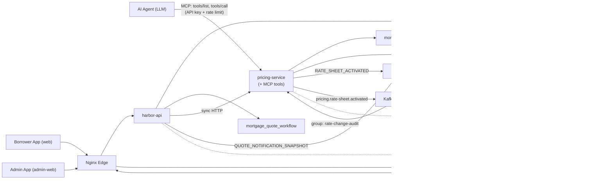

# Harbor Loan Quotes

[](https://github.com/JayCodesX/harbor-loan-quote/actions/workflows/ci.yml)

Mortgage quote and lead-generation platform: a borrower-facing React app, a separate admin app, an Nginx edge, and Spring Boot services — extended with an **AI-agent tool layer (MCP)**, a **Kafka event stream**, **distributed tracing**, and a **one-command cloud deploy**.

## Highlights
- **Three-service backend** — harbor-api owns loan quotes, auth, borrowers, leads, and admin in-process; pricing-service runs the pricing engine; notification-service delivers SSE updates. Domain-per-service with no cross-service table access.
- **AI-agent integration (MCP)** — pricing-service exposes its engine to LLM agents as discoverable, typed **Model Context Protocol** tools via Spring AI ([ADR-0051](./docs/adr/phase-4-ai-integration/0051-expose-pricing-via-mcp.md)), secured with API-key auth + Bucket4j rate limiting at the agent boundary ([ADR-0053](./docs/adr/phase-4-ai-integration/0053-secure-and-rate-limit-the-mcp-boundary.md)). A [provider-agnostic client demo](./mcp-client-demo) drives it with any OpenAI-compatible model ([ADR-0054](./docs/adr/phase-4-ai-integration/0054-mcp-client-agent-demo.md)).
- **Event streaming (Kafka / Redpanda)** — rate-sheet activations fan out over a Kafka event stream to independent, replayable consumer groups (audit + SSE push), complementing RabbitMQ for work queues ([ADR-0052](./docs/adr/phase-2-pricing-engine/0052-kafka-rate-change-event-stream.md)).
- **Observability** — OpenTelemetry → Grafana (Tempo/Loki/Prometheus) with a single otel-lgtm container; one trace spans agent → MCP → pricing → DB, and rate-sheet → Kafka → consumers across services ([ADR-0030](./docs/adr/phase-3-scale-and-operations/0030-observability-strategy.md)).
- **RabbitMQ async messaging** — harbor-api and pricing-service publish to topic exchanges; notification-service consumes and pushes SSE. Built on a broker-agnostic transport abstraction ([ADR-0007](./docs/adr/phase-1-foundation/0007-messaging-transport-abstraction.md), [ADR-0050](./docs/adr/phase-2-pricing-engine/0050-message-broker-selection.md)).
- **Pluggable security** — self-issued HMAC JWTs or OIDC (Keycloak), plus service-to-service JWTs validated on issuer/audience/scope/type.
- **Cloud deploy kit** — full stack on one Oracle Always-Free ARM instance behind an outbound Cloudflare Tunnel (no inbound ports), via a prod compose override + runbook ([ADR-0055](./docs/adr/phase-3-scale-and-operations/0055-oracle-cloud-cloudflare-tunnel-deployment.md)).
- **Tested** — JUnit unit tests plus **Testcontainers integration tests** (real Redpanda + MySQL) across the services, frontend unit tests, and a Playwright E2E suite in CI.
- **Decision-driven** — 56 [ADRs](./docs/adr) capture the design reasoning behind the system.

## Tech Stack
**Backend:** Java 17/21, Spring Boot, Spring AI (MCP), MyBatis · **Data:** MySQL, Redis · **Messaging:** RabbitMQ (work queues) + Kafka/Redpanda (event stream), via a broker-agnostic transport · **Observability:** OpenTelemetry, Grafana (Tempo/Loki/Prometheus) · **AI:** Model Context Protocol, any OpenAI-compatible LLM (Ollama, OpenAI, …) · **Auth:** JWT, OIDC/Keycloak, API keys · **Frontend:** React, Vite · **Infra:** Docker Compose, Nginx, Cloudflare Tunnel, Oracle Cloud, Jenkins CI

> Note: this is a personal portfolio project demonstrating backend and distributed-systems **architecture and design reasoning**. The full stack runs with a single `docker compose up`. All credentials in the repo are clearly-labeled local-development placeholders.

Additional docs:
- [Architecture overview](./docs/architecture.md)
- [Operations runbook](./docs/ops-runbook.md)
- [Oracle Cloud deploy runbook](./docs/deploy/oracle-cloud-runbook.md)
- [MCP agent client demo](./mcp-client-demo)

## Runtime Overview
- `web`: borrower-facing React + Vite app served by Nginx
- `admin-web`: admin React + Vite app served by Nginx at `/admin/`
- `edge`: public Nginx reverse proxy on `8088` and `8443`
- `api` (harbor-api): public quote orchestration, calculators, metrics aggregation, notification publishing; also owns auth, borrowers, leads, and admin endpoints in-process
- `pricing-service`: synchronous HTTP pricing engine with a persisted pricing catalog; **exposes MCP tools for AI agents**; publishes rate-sheet activations to RabbitMQ and the Kafka event stream
- `notification-service`: quote snapshot delivery and SSE notifications; consumes rate-change events from RabbitMQ or Kafka
- `rabbitmq`: work-queue broker; management UI at `http://localhost:15672` (guest/guest)
- `redpanda`: Kafka-API event stream for rate-change fan-out (audit + SSE consumers)
- `otel-lgtm`: Grafana observability stack (Tempo/Loki/Prometheus, OTLP); Grafana UI at `http://localhost:3000`
- `mysql`: relational persistence
- `redis`: session state, dedupe state, cache support, metrics counters, notification snapshots
- `cloudflared` *(prod only)*: outbound Cloudflare Tunnel for the cloud deploy
- `localstack` *(optional — `integration` profile)*: local SQS emulation for the Phase-3 adapter path

## Architecture


## What The System Does

1. Anonymous user requests a public mortgage quote.
2. `harbor-api` deduplicates repeated requests per session and persists quote state.
3. `harbor-api` calls `pricing-service` synchronously over HTTP; `pricing-service` prices the scenario from its persisted product catalog and returns a result.
4. `harbor-api` updates the quote read model with the pricing result.
5. If an authenticated user refines the quote, `harbor-api` captures the lead in-process.
6. `harbor-api` publishes a quote notification snapshot to the `quote.notification.events` RabbitMQ exchange (routing key `QUOTE_NOTIFICATION_SNAPSHOT`).
7. `notification-service` consumes from queue `quote.notification.snapshot`, stores the snapshot in Redis, and pushes an SSE update to the frontend.
8. When a rate sheet is activated, `pricing-service` publishes it two ways: `RATE_SHEET_ACTIVATED` to RabbitMQ (existing notification flow), and to the `pricing.rate-sheet.activated` **Kafka** topic, which fans out to independent consumer groups — `rate-change-audit` (durable, replayable audit log) and `rate-change-sse` (SSE broadcast). Cache eviction stays in-process at the write site.
9. `admin-web` reads aggregated metrics through `harbor-api`.
10. **AI agents** call `pricing-service` directly over MCP: they discover the typed tools (`getRateQuote`, `listLoanPrograms`, `getLoanProgramDetails`), call them through the API-key + rate-limited gateway, and get real quotes from the same engine — no reimplementation, no hallucinated numbers.

## Service Boundaries

### `api` (harbor-api)
Owns:
- public quote creation and retrieval
- quote refinement orchestration
- quote read model in `mortgage_quote_workflow`
- monthly payment and amortization calculators
- session-aware deduplication
- quote metrics and admin summary aggregation
- notification snapshot publishing
- service-to-service JWT issuance for workers and internal clients
- user registration, login, and access token issuance (auth)
- borrower creation, retrieval, existence checks, and borrower metrics
- lead creation from completed refined quotes and lead metrics

### `pricing-service`
Owns:
- synchronous quote pricing (called by harbor-api over HTTP per ADR-0003)
- pricing catalog persistence in `mortgage_pricing`
- pricing products, rate sheets, and adjustment rules
- Redis pricing cache
- pricing metrics
- rate-sheet-activated event publishing to RabbitMQ **and Kafka**
- the **`rate-change-audit`** Kafka consumer (durable rate-change audit log)
- the **MCP server**: `@Tool`-annotated adapters over the pricing engine, an API-key + Bucket4j rate-limit gateway on `/sse` and `/mcp/**`

### `notification-service`
Owns:
- quote notification event consumption from RabbitMQ
- rate-sheet-activated consumption from RabbitMQ **or the `rate-change-sse` Kafka group** (config-selectable)
- latest quote snapshot cache in Redis
- quote snapshot fetch endpoint
- quote SSE endpoint used by the frontend

## Database Ownership
- `api` (harbor-api) → `mortgage_quote_workflow` (auth, borrower, lead, and quote tables all in one schema owned by harbor-api)
- `pricing-service` → `mortgage_pricing`
- `notification-service` → Redis only

Each service owns its own database schema — no cross-service table access.

## Messaging Topology

> **Two brokers, each for its pattern** ([ADR-0050](./docs/adr/phase-2-pricing-engine/0050-message-broker-selection.md), [ADR-0052](./docs/adr/phase-2-pricing-engine/0052-kafka-rate-change-event-stream.md)): **RabbitMQ** for point-to-point work queues (via the broker-agnostic transport, [ADR-0007](./docs/adr/phase-1-foundation/0007-messaging-transport-abstraction.md)); **Kafka/Redpanda** for the rate-change *event stream* that needs multiple independent consumers with retention and replay. SQS/LocalStack is the optional Phase-3 adapter path (`integration` profile). Lead processing is in-process (ADR-0003) — no lead queues.

### Flow A — Quote notification (harbor-api → notification-service, RabbitMQ)

| Component | Name |
|---|---|
| Exchange | `quote.notification.events` (topic) |
| Routing key | `QUOTE_NOTIFICATION_SNAPSHOT` |
| Queue | `quote.notification.snapshot` |

### Flow B — Rate-sheet activation (pricing-service → RabbitMQ, existing)

| Component | Name |
|---|---|
| Exchange | `rate-sheet.events` (topic) |
| Routing key | `RATE_SHEET_ACTIVATED` |
| Queue | `rate-sheet.activated` |

### Flow C — Rate-change event stream (pricing-service → Kafka, [ADR-0052](./docs/adr/phase-2-pricing-engine/0052-kafka-rate-change-event-stream.md))

| Component | Name |
|---|---|
| Topic | `pricing.rate-sheet.activated` (keyed by `investorId`) |
| Consumer group | `rate-change-audit` (pricing-service) → durable `rate_change_audit` table, reads from earliest (replay) |
| Consumer group | `rate-change-sse` (notification-service) → SSE broadcast, reads from latest |

Audit consumers are idempotent (unique `rate_sheet_id`), so at-least-once redelivery and offset replay are safe. Cache invalidation is deliberately **not** a Kafka consumer — it stays synchronous at the write site because the cache is shared Redis.

### Message contract hardening
All asynchronous message payloads carry:
- `schemaVersion`
- `messageId`

Consumers:
- reject unsupported schema versions
- dedupe deliveries on `messageId`
- publish poison messages to DLQs when processing fails

### SQS / LocalStack (Phase-3 path)
The SQS adapter and LocalStack container exist behind the `integration` profile. The queues provisioned by `localstack/init/01-create-queues.sh` are the Phase-3 targets. Use the `dlq-*.sh` scripts against that path only.

## AI Agent Integration (MCP)

`pricing-service` exposes its pricing engine to AI agents over the **Model Context Protocol** using Spring AI ([ADR-0051](./docs/adr/phase-4-ai-integration/0051-expose-pricing-via-mcp.md)). Business capabilities are thin `@Tool` adapters over the existing `QuotePricingService` — the agent contract is decoupled from internals; no pricing logic is reimplemented.

- **Tools:** `getRateQuote`, `listLoanPrograms`, `getLoanProgramDetails`
- **Transport:** SSE over Spring MVC (`GET /sse`, `POST /mcp/message`)
- **Security ([ADR-0053](./docs/adr/phase-4-ai-integration/0053-secure-and-rate-limit-the-mcp-boundary.md)):** a scoped filter on `/sse` + `/mcp/**` enforces API-key auth (`X-API-Key`) then per-key Bucket4j rate limiting — before any request reaches the DB or cache
- **Config:** `HARBOR_MCP_ENABLED`, `HARBOR_MCP_API_KEYS`, `HARBOR_MCP_RPM`

A **provider-agnostic client demo** ([`mcp-client-demo/`](./mcp-client-demo), [ADR-0054](./docs/adr/phase-4-ai-integration/0054-mcp-client-agent-demo.md)) lets any OpenAI-compatible model (Ollama, OpenAI, Groq, …) discover the tools and call them to answer a natural-language mortgage question:

```bash
cd mcp-client-demo && cp .env.example .env   # set MCP_API_KEY + LLM_* vars
python3 harbor_agent_demo.py "What rate could I get on a $500k home, $100k down, conventional 30-yr in 89101?"
```

## Observability

Distributed tracing via **OpenTelemetry → Grafana** ([ADR-0030](./docs/adr/phase-3-scale-and-operations/0030-observability-strategy.md)). Services emit vendor-neutral OTLP; the backend is a single `grafana/otel-lgtm` container (Tempo/Loki/Prometheus). Kafka trace context propagates over message headers, so a rate-sheet activation is **one trace** from HTTP → JDBC → Kafka → the audit + SSE consumers across services. Grafana UI at `http://localhost:3000`.

- **Config:** `OTLP_TRACING_ENDPOINT` (default `http://localhost:4318/v1/traces`), `MANAGEMENT_TRACING_SAMPLING` (1.0 dev, lower in prod)

## Deployment

The full stack deploys to one **Oracle Cloud Always-Free ARM** instance behind an outbound **Cloudflare Tunnel** — no inbound ports, TLS at Cloudflare ([ADR-0055](./docs/adr/phase-3-scale-and-operations/0055-oracle-cloud-cloudflare-tunnel-deployment.md)). A `docker-compose.prod.yml` override adds the tunnel + prod config; secrets come from `.env.prod`.

```bash
docker compose --env-file .env.prod -f docker-compose.yml -f docker-compose.prod.yml up -d --build \
  mysql redis rabbitmq redpanda otel-lgtm \
  pricing-service notification-service api web admin-web edge-tunnel cloudflared
```

See the [Oracle Cloud deploy runbook](./docs/deploy/oracle-cloud-runbook.md) for the step-by-step.

## Security Model

### User authentication
Two modes are supported for protected user-facing endpoints in `api`:
- `internal`: built-in auth (in harbor-api) issues HMAC-signed JWTs
- `oidc`: local Keycloak issues OIDC access tokens validated from a configured JWK set URI

Required OIDC settings:
- `APP_USER_TOKEN_PROVIDER=oidc`
- `APP_USER_TOKEN_ISSUER=http://keycloak:8080/realms/mortgage-loan-api`
- `APP_USER_TOKEN_AUDIENCE=mortgage-loan-api-web`
- `APP_USER_TOKEN_JWK_SET_URI=http://keycloak:8080/realms/mortgage-loan-api/protocol/openid-connect/certs`

### Service-to-service authentication
Internal services use service JWTs with issuer, audience, scope, and type validation.

Examples:
- `harbor-api` → `pricing-service` via job token (sync HTTP)
- `harbor-api` → `notification-service` via job token (RabbitMQ message header)

## Session Tracking And Deduplication
The borrower-facing frontend generates and persists a session ID and sends it on quote requests with `X-Session-Id`.

`api` uses Redis to:
- track active sessions
- detect in-flight duplicate quote requests
- return the existing `quoteId` when a duplicate request is already `QUEUED` or `PROCESSING`
- maintain fast quote status snapshots for the async flow

## Metrics And Admin Surface

### Borrower-facing app
The public app is borrower-first and intentionally hides internal platform views.
It focuses on:
- guided public quote request
- borrower quote refinement after sign-in
- my quotes history
- public calculators
- lender and agent match directory

### Admin app
The separate admin app at `/admin/` displays:
- borrower totals and credit-score distribution
- quote funnel and quote outcomes
- pricing product distribution
- lead status distribution
- system snapshot metrics
- lender and agent directory management

### Admin summary endpoint
- `GET /api/metrics/admin/summary`

Admin access requires an `ADMIN` role token.

This endpoint aggregates:
- quote metrics from `harbor-api`
- borrower metrics from `harbor-api`
- pricing catalog metrics from `pricing-service`
- lead metrics from `harbor-api`

## Local Run Modes

### Default stack (full 3-service RabbitMQ stack)
```bash
docker compose up -d --build
```

Brings up: `rabbitmq`, `mysql`, `redis`, `api`, `pricing-service`, `notification-service`, `admin-web`, `web`, `edge`.

To watch a message flow end to end, open the RabbitMQ management UI at **http://localhost:15672** (guest/guest) and observe queues `quote.notification.snapshot` and `rate-sheet.activated`.

### Optional LocalStack/SQS profile (Phase-3 path)
```bash
docker compose --env-file .env.integration --profile integration up -d --build
# or:
make up
```

Stop the stack:

```bash
docker compose --env-file .env.integration --profile integration down
# or:
make down
```

The [`.env.integration`](./.env.integration) file switches the transport to SQS so `api` publishes pricing jobs to LocalStack queues for demos and CI.

### Optional OIDC profile with Keycloak
```bash
APP_USER_TOKEN_PROVIDER=oidc \
APP_USER_TOKEN_ISSUER=http://keycloak:8080/realms/mortgage-loan-api \
APP_USER_TOKEN_AUDIENCE=mortgage-loan-api-web \
APP_USER_TOKEN_JWK_SET_URI=http://keycloak:8080/realms/mortgage-loan-api/protocol/openid-connect/certs \
docker compose --profile oidc up -d --build keycloak mysql redis rabbitmq api pricing-service notification-service web admin-web edge
```

Local Keycloak URLs:
- issuer: `http://localhost:18080/realms/mortgage-loan-api`
- admin console: `http://localhost:18080/admin`

Imported demo credentials:
- Keycloak console: `admin` / `admin`
- admin user: `admin@example.com` / `StrongPass123!`
- test user: `testuser` / `StrongPass123!`

### Stop everything
```bash
docker compose down
```

### Local URLs
- borrower app: `http://localhost:8088`
- borrower app (TLS): `https://localhost:8443`
- admin app (TLS): `https://localhost:8443/admin/`
- health: `https://localhost:8443/actuator/health`
- RabbitMQ management UI: `http://localhost:15672` (guest/guest)

If local TLS certs are missing:
```bash
./scripts/generate-local-certs.sh
```

## Testing

### Backend tests
```bash
mvn -Dmaven.repo.local=.m2 test
cd pricing-service && mvn test
cd notification-service && mvn test
```

### Frontend unit tests
```bash
cd web && npm run test:ci
cd admin-web && npm run test:ci
```

### Browser end-to-end tests
The Playwright suite lives in [e2e](./e2e).

Install once:
```bash
cd e2e
npm install
npx playwright install chromium
```

Run against the full integration stack:
```bash
docker compose --env-file .env.integration --profile integration up -d --build
cd e2e
npm run test
cd ..
docker compose --env-file .env.integration --profile integration down
```

### Local smoke check
Use the checked-in smoke runner after the stack is up:

```bash
./scripts/local-smoke.sh
```

Or:
```bash
make smoke
```

What it verifies:
- borrower quote flow
- borrower auth redirect before personalization
- admin login
- admin workspace access

### Make targets
```bash
make up
make smoke
make e2e
make down
```

Covered flows:
- borrower public quote request
- borrower auth redirect before personalization
- direct admin login
- admin workspace access

## CI
**GitHub Actions** ([`.github/workflows/ci.yml`](./.github/workflows/ci.yml)) — triggered **manually** (Actions tab → "Run workflow", or `gh workflow run ci.yml`); not run on push/PR by design, to keep CI usage in check. It runs:
- JUnit suites for all three Java services (harbor-api, pricing-service, notification-service)
- frontend unit tests (`test:ci`) for `web` and `admin-web`
- frontend production builds

A [Jenkinsfile](./Jenkinsfile) mirrors the above and additionally runs the Playwright E2E suite on the integration-profile Docker stack (kept out of GitHub Actions to avoid a heavy full-stack spin-up on every PR).

## Frontend Apps

### Borrower app
Source:
- `web/`

Focus:
- public quote flow
- refined quote flow
- my quotes history
- calculators
- lender and agent match directory
- login/register
- quote status updates through notification SSE or polling fallback

### Admin app
Source:
- `admin-web/`

Focus:
- operational visibility
- borrower, quote, lead, and pricing metrics
- lender and agent directory management

## Java Namespace
All Java services use:

```text
com.jaycodesx.mortgage
```

The default scaffold namespace was removed.

## Directory Structure

### `api` (harbor-api)
```text
src/main/java/com/jaycodesx/mortgage
├─ MortgageApplication.java
├─ auth
│  ├─ controller
│  ├─ dto
│  ├─ model
│  ├─ repository
│  └─ service
├─ borrower
│  ├─ controller
│  ├─ dto
│  ├─ model
│  ├─ repository
│  └─ service
├─ infrastructure
│  ├─ admin
│  ├─ borrower
│  ├─ config
│  ├─ messaging
│  ├─ metrics
│  └─ security
├─ lead
│  ├─ dto
│  ├─ model
│  └─ repository
├─ pricing
│  └─ service
├─ quote
│  ├─ controller
│  ├─ dto
│  ├─ model
│  ├─ repository
│  └─ service
└─ shared
   ├─ controller
   ├─ dto
   ├─ model
   ├─ repository
   └─ service
```

### `pricing-service`
```text
pricing-service/src/main/java/com/jaycodesx/mortgage
├─ PricingServiceApplication.java
├─ mcp                        # MCP server: @Tool adapters + API-key/rate-limit gateway
│  ├─ MortgagePricingTools.java
│  ├─ McpToolConfig.java
│  ├─ McpGatewayFilter.java
│  └─ McpSecurityProperties.java
├─ infrastructure
│  ├─ config
│  ├─ messaging
│  │  └─ kafka             # rate-change event stream (topic config + properties)
│  ├─ metrics
│  └─ security
├─ pricing
│  ├─ messaging            # RateChangeEventPublisher + RateChangeAuditListener
│  ├─ model
│  ├─ repository
│  └─ service
├─ quote
│  ├─ dto
│  ├─ model
│  ├─ repository
│  └─ service
└─ shared
   └─ service
```

### `notification-service`
```text
notification-service/src/main/java/com/jaycodesx/mortgage
├─ NotificationServiceApplication.java
├─ infrastructure
│  ├─ messaging
│  └─ security
├─ lead
│  └─ dto
├─ notification
│  ├─ controller
│  ├─ dto
│  └─ service
```

### `admin-web`
```text
admin-web
├─ src
├─ public
├─ Dockerfile
├─ nginx.conf
└─ package.json
```

### Agent & deploy tooling
```text
mcp-client-demo/          # provider-agnostic MCP agent client (stdlib Python)
├─ harbor_agent_demo.py
├─ .env.example
└─ README.md
cloudflared/              # Cloudflare Tunnel ingress (config.example.yml; real config gitignored)
docker-compose.prod.yml   # prod override: tunnel + MCP/Kafka/tracing env
nginx/default.tunnel.conf # TLS-free routing for the tunnel deploy
.env.prod.example         # production secrets template
```

## Primary API Endpoints

### Public quote and quote lifecycle
- `POST /api/loan-quotes/public`
- `GET /api/loan-quotes/{id}`
- `POST /api/loan-quotes/{id}/refine`
- `GET /api/loan-quotes/{id}/events`

### Free calculators
- `GET /api/loans/mortgage-payment/calculate`
- `GET /api/loans/amortization/calculate`

### Auth
- `POST /api/auth/register`
- `POST /api/auth/login`
- `POST /api/auth/refresh`

### Borrowers
- `POST /api/borrowers`
- `GET /api/borrowers/{id}`

### Notifications
- `GET /api/notifications/quotes/{id}`
- `GET /api/notifications/quotes/{id}/events`

### Borrower quote history
- `GET /api/borrower/quotes`

### Directory
- `GET /api/directory/locations`
- `GET /api/directory/agents`
- `GET /api/directory/lenders`

### Admin directory management
- `GET /admin/agents`
- `GET /admin/lenders`

### Metrics
- `GET /api/metrics/quotes`
- `GET /api/metrics/admin/summary`
- `POST /api/metrics/quotes/sessions/authenticated`

### MCP (agent-facing, on pricing-service — requires `X-API-Key`)
- `GET /sse` — open the MCP session (SSE)
- `POST /mcp/message` — JSON-RPC channel (`tools/list`, `tools/call`)

## Build And Test

### Backend tests
```bash
mvn -Dmaven.repo.local=.m2 test
```

Unit tests are pure Mockito; **integration tests use Testcontainers** (real Redpanda + MySQL) to exercise the Kafka producer → topic → audit consumer → DB chain, idempotency against the real unique constraint, and the cross-service SSE consumer's deserialization. On Docker Desktop, the surefire config pins the Docker Engine API version so Testcontainers can discover the daemon.

### Borrower app
```bash
cd ./web
npm install
npm run build
```

### Admin app
```bash
cd ./admin-web
npm install
npm run build
```

## Operations And Replay

The `dlq-*.sh` scripts operate against the LocalStack SQS path (Phase-3 / `integration` profile). For the default RabbitMQ stack, use the management UI at **http://localhost:15672** or service logs to inspect message flow.

Inspect SQS DLQs (LocalStack / Phase-3):
```bash
./scripts/dlq-inspect.sh quote-pricing-results-dlq
./scripts/dlq-inspect.sh quote-notification-events-dlq
```

Replay DLQ messages:
```bash
./scripts/dlq-replay.sh quote-pricing-results-dlq quote-pricing-results
./scripts/dlq-replay.sh quote-notification-events-dlq quote-notification-events
```

For a fuller operator workflow, see:
- [Operations runbook](./docs/ops-runbook.md)
