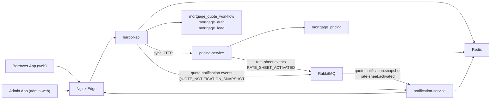

# Harbor Loan Quotes

[](https://github.com/JayCodesX/harbor-loan-quote/actions/workflows/ci.yml)

Mortgage quote and lead-generation platform with a borrower-facing React app, a separate admin app, an edge Nginx proxy, and Spring Boot microservices.

## Highlights
- **Three-service backend** — harbor-api owns loan quotes, auth, borrowers, leads, and admin in-process; pricing-service runs the async pricing engine; notification-service delivers SSE updates. Domain-per-service with no cross-service table access.
- **Synchronous quote platform** — public quotes, refinement, calculators, auth, borrower APIs, and aggregated metrics are implemented and run today.
- **RabbitMQ async messaging, running locally** — harbor-api and pricing-service publish to RabbitMQ topic exchanges; notification-service consumes and pushes SSE to the frontend. Built on a broker-agnostic transport abstraction ([ADR-0007](./docs/adr/phase-1-foundation/0007-messaging-transport-abstraction.md), [ADR-0050](./docs/adr/phase-2-pricing-engine/0050-message-broker-selection.md)) so the broker is a config choice; SQS is the Phase-3 target.
- **Pluggable security** — self-issued HMAC JWTs or OIDC (Keycloak), plus service-to-service JWTs validated on issuer/audience/scope/type.
- **Two React frontends** (borrower + admin), an Nginx TLS edge, and a full Docker Compose stack.
- **Tested** — JUnit across all services, frontend unit tests, and a Playwright E2E suite in CI.
- **Decision-driven** — 50 [ADRs](./docs/adr) capture the design reasoning behind the system.

## Tech Stack
**Backend:** Java 17, Spring Boot, MyBatis · **Data:** MySQL, Redis · **Async:** RabbitMQ (local default) via a broker-agnostic transport; SQS for Phase-3 · **Auth:** JWT, OIDC/Keycloak · **Frontend:** React, Vite · **Infra:** Docker Compose, Nginx, Jenkins CI

> Note: this is a personal portfolio project demonstrating backend and distributed-systems **architecture and design reasoning**. The synchronous services and the RabbitMQ async pipeline all run with a single `docker compose up`. All credentials in the repo are clearly-labeled local-development placeholders.

Additional docs:
- [Architecture overview](./docs/architecture.md)
- [Operations runbook](./docs/ops-runbook.md)

## Runtime Overview
- `web`: borrower-facing React + Vite app served by Nginx
- `admin-web`: admin React + Vite app served by Nginx at `/admin/`
- `edge`: public Nginx reverse proxy on `8088` and `8443`
- `api` (harbor-api): public quote orchestration, calculators, metrics aggregation, notification publishing; also owns auth, borrowers, leads, and admin endpoints in-process
- `pricing-service`: synchronous HTTP pricing engine with a persisted pricing catalog; publishes rate-sheet-activated events to RabbitMQ
- `notification-service`: quote snapshot delivery and SSE notifications; consumes RabbitMQ events from harbor-api and pricing-service
- `rabbitmq`: local message broker; management UI at `http://localhost:15672` (guest/guest)
- `mysql`: relational persistence
- `redis`: session state, dedupe state, cache support, metrics counters, notification snapshots
- `localstack` *(optional — `integration` profile)*: local SQS emulation for the Phase-3 adapter path

## Architecture


## What The System Does

1. Anonymous user requests a public mortgage quote.
2. `harbor-api` deduplicates repeated requests per session and persists quote state.
3. `harbor-api` calls `pricing-service` synchronously over HTTP; `pricing-service` prices the scenario from its persisted product catalog and returns a result.
4. `harbor-api` updates the quote read model with the pricing result.
5. If an authenticated user refines the quote, `harbor-api` captures the lead in-process.
6. `harbor-api` publishes a quote notification snapshot to the `quote.notification.events` RabbitMQ exchange (routing key `QUOTE_NOTIFICATION_SNAPSHOT`).
7. `notification-service` consumes from queue `quote.notification.snapshot`, stores the snapshot in Redis, and pushes an SSE update to the frontend.
8. When a rate sheet is activated, `pricing-service` publishes a `RATE_SHEET_ACTIVATED` event to the `rate-sheet.events` exchange; `notification-service` consumes it from queue `rate-sheet.activated`.
9. `admin-web` reads aggregated metrics through `harbor-api`.

## Service Boundaries

### `api` (harbor-api)
Owns:
- public quote creation and retrieval
- quote refinement orchestration
- quote read model in `mortgage_quote_workflow`
- monthly payment and amortization calculators
- session-aware deduplication
- quote metrics and admin summary aggregation
- notification snapshot publishing
- service-to-service JWT issuance for workers and internal clients
- user registration, login, and access token issuance (auth)
- borrower creation, retrieval, existence checks, and borrower metrics
- lead creation from completed refined quotes and lead metrics

### `pricing-service`
Owns:
- synchronous quote pricing (called by harbor-api over HTTP per ADR-0003)
- pricing catalog persistence in `mortgage_pricing`
- pricing products, rate sheets, and adjustment rules
- Redis pricing cache
- pricing metrics
- rate-sheet-activated event publishing to RabbitMQ

### `notification-service`
Owns:
- quote notification event consumption from RabbitMQ
- rate-sheet-activated event consumption from RabbitMQ
- latest quote snapshot cache in Redis
- quote snapshot fetch endpoint
- quote SSE endpoint used by the frontend

## Database Ownership
- `api` (harbor-api) → `mortgage_quote_workflow` (auth, borrower, lead, and quote tables all in one schema owned by harbor-api)
- `pricing-service` → `mortgage_pricing`
- `notification-service` → Redis only

Each service owns its own database schema — no cross-service table access.

## Messaging Topology

> **Status:** async messaging runs locally over RabbitMQ via the broker-agnostic transport abstraction ([ADR-0007](./docs/adr/phase-1-foundation/0007-messaging-transport-abstraction.md)). The active transport is `rabbitmq` (default in Docker Compose). SQS/LocalStack is the optional Phase-3 adapter path, available behind the `integration` profile. Lead processing is in-process in harbor-api (ADR-0003) — there are no lead queues.

### Flow A — Quote notification (harbor-api → notification-service)

| Component | Name |
|---|---|
| Exchange | `quote.notification.events` (topic) |
| Routing key | `QUOTE_NOTIFICATION_SNAPSHOT` |
| Queue | `quote.notification.snapshot` |

### Flow B — Rate-sheet activation (pricing-service → notification-service)

| Component | Name |
|---|---|
| Exchange | `rate-sheet.events` (topic) |
| Routing key | `RATE_SHEET_ACTIVATED` |
| Queue | `rate-sheet.activated` |

### Message contract hardening
All asynchronous message payloads carry:
- `schemaVersion`
- `messageId`

Consumers:
- reject unsupported schema versions
- dedupe deliveries on `messageId`
- publish poison messages to DLQs when processing fails

### SQS / LocalStack (Phase-3 path)
The SQS adapter and LocalStack container exist behind the `integration` profile. The queues provisioned by `localstack/init/01-create-queues.sh` are the Phase-3 targets. Use the `dlq-*.sh` scripts against that path only.

## Security Model

### User authentication
Two modes are supported for protected user-facing endpoints in `api`:
- `internal`: built-in auth (in harbor-api) issues HMAC-signed JWTs
- `oidc`: local Keycloak issues OIDC access tokens validated from a configured JWK set URI

Required OIDC settings:
- `APP_USER_TOKEN_PROVIDER=oidc`
- `APP_USER_TOKEN_ISSUER=http://keycloak:8080/realms/mortgage-loan-api`
- `APP_USER_TOKEN_AUDIENCE=mortgage-loan-api-web`
- `APP_USER_TOKEN_JWK_SET_URI=http://keycloak:8080/realms/mortgage-loan-api/protocol/openid-connect/certs`

### Service-to-service authentication
Internal services use service JWTs with issuer, audience, scope, and type validation.

Examples:
- `harbor-api` → `pricing-service` via job token (sync HTTP)
- `harbor-api` → `notification-service` via job token (RabbitMQ message header)

## Session Tracking And Deduplication
The borrower-facing frontend generates and persists a session ID and sends it on quote requests with `X-Session-Id`.

`api` uses Redis to:
- track active sessions
- detect in-flight duplicate quote requests
- return the existing `quoteId` when a duplicate request is already `QUEUED` or `PROCESSING`
- maintain fast quote status snapshots for the async flow

## Metrics And Admin Surface

### Borrower-facing app
The public app is borrower-first and intentionally hides internal platform views.
It focuses on:
- guided public quote request
- borrower quote refinement after sign-in
- my quotes history
- public calculators
- lender and agent match directory

### Admin app
The separate admin app at `/admin/` displays:
- borrower totals and credit-score distribution
- quote funnel and quote outcomes
- pricing product distribution
- lead status distribution
- system snapshot metrics
- lender and agent directory management

### Admin summary endpoint
- `GET /api/metrics/admin/summary`

Admin access requires an `ADMIN` role token.

This endpoint aggregates:
- quote metrics from `harbor-api`
- borrower metrics from `harbor-api`
- pricing catalog metrics from `pricing-service`
- lead metrics from `harbor-api`

## Local Run Modes

### Default stack (full 3-service RabbitMQ stack)
```bash
docker compose up -d --build
```

Brings up: `rabbitmq`, `mysql`, `redis`, `api`, `pricing-service`, `notification-service`, `admin-web`, `web`, `edge`.

To watch a message flow end to end, open the RabbitMQ management UI at **http://localhost:15672** (guest/guest) and observe queues `quote.notification.snapshot` and `rate-sheet.activated`.

### Optional LocalStack/SQS profile (Phase-3 path)
```bash
docker compose --env-file .env.integration --profile integration up -d --build
# or:
make up
```

Stop the stack:

```bash
docker compose --env-file .env.integration --profile integration down
# or:
make down
```

The [`.env.integration`](./.env.integration) file switches the transport to SQS so `api` publishes pricing jobs to LocalStack queues for demos and CI.

### Optional OIDC profile with Keycloak
```bash
APP_USER_TOKEN_PROVIDER=oidc \
APP_USER_TOKEN_ISSUER=http://keycloak:8080/realms/mortgage-loan-api \
APP_USER_TOKEN_AUDIENCE=mortgage-loan-api-web \
APP_USER_TOKEN_JWK_SET_URI=http://keycloak:8080/realms/mortgage-loan-api/protocol/openid-connect/certs \
docker compose --profile oidc up -d --build keycloak mysql redis rabbitmq api pricing-service notification-service web admin-web edge
```

Local Keycloak URLs:
- issuer: `http://localhost:18080/realms/mortgage-loan-api`
- admin console: `http://localhost:18080/admin`

Imported demo credentials:
- Keycloak console: `admin` / `admin`
- admin user: `admin@example.com` / `StrongPass123!`
- test user: `testuser` / `StrongPass123!`

### Stop everything
```bash
docker compose down
```

### Local URLs
- borrower app: `http://localhost:8088`
- borrower app (TLS): `https://localhost:8443`
- admin app (TLS): `https://localhost:8443/admin/`
- health: `https://localhost:8443/actuator/health`
- RabbitMQ management UI: `http://localhost:15672` (guest/guest)

If local TLS certs are missing:
```bash
./scripts/generate-local-certs.sh
```

## Testing

### Backend tests
```bash
mvn -Dmaven.repo.local=.m2 test
cd pricing-service && mvn test
cd notification-service && mvn test
```

### Frontend unit tests
```bash
cd web && npm run test:ci
cd admin-web && npm run test:ci
```

### Browser end-to-end tests
The Playwright suite lives in [e2e](./e2e).

Install once:
```bash
cd e2e
npm install
npx playwright install chromium
```

Run against the full integration stack:
```bash
docker compose --env-file .env.integration --profile integration up -d --build
cd e2e
npm run test
cd ..
docker compose --env-file .env.integration --profile integration down
```

### Local smoke check
Use the checked-in smoke runner after the stack is up:

```bash
./scripts/local-smoke.sh
```

Or:
```bash
make smoke
```

What it verifies:
- borrower quote flow
- borrower auth redirect before personalization
- admin login
- admin workspace access

### Make targets
```bash
make up
make smoke
make e2e
make down
```

Covered flows:
- borrower public quote request
- borrower auth redirect before personalization
- direct admin login
- admin workspace access

## CI
**GitHub Actions** ([`.github/workflows/ci.yml`](./.github/workflows/ci.yml)) — triggered **manually** (Actions tab → "Run workflow", or `gh workflow run ci.yml`); not run on push/PR by design, to keep CI usage in check. It runs:
- JUnit suites for all three Java services (harbor-api, pricing-service, notification-service)
- frontend unit tests (`test:ci`) for `web` and `admin-web`
- frontend production builds

A [Jenkinsfile](./Jenkinsfile) mirrors the above and additionally runs the Playwright E2E suite on the integration-profile Docker stack (kept out of GitHub Actions to avoid a heavy full-stack spin-up on every PR).

## Frontend Apps

### Borrower app
Source:
- `web/`

Focus:
- public quote flow
- refined quote flow
- my quotes history
- calculators
- lender and agent match directory
- login/register
- quote status updates through notification SSE or polling fallback

### Admin app
Source:
- `admin-web/`

Focus:
- operational visibility
- borrower, quote, lead, and pricing metrics
- lender and agent directory management

## Java Namespace
All Java services use:

```text
com.jaycodesx.mortgage
```

The default scaffold namespace was removed.

## Directory Structure

### `api` (harbor-api)
```text
src/main/java/com/jaycodesx/mortgage
├─ MortgageApplication.java
├─ auth
│  ├─ controller
│  ├─ dto
│  ├─ model
│  ├─ repository
│  └─ service
├─ borrower
│  ├─ controller
│  ├─ dto
│  ├─ model
│  ├─ repository
│  └─ service
├─ infrastructure
│  ├─ admin
│  ├─ borrower
│  ├─ config
│  ├─ messaging
│  ├─ metrics
│  └─ security
├─ lead
│  ├─ dto
│  ├─ model
│  └─ repository
├─ pricing
│  └─ service
├─ quote
│  ├─ controller
│  ├─ dto
│  ├─ model
│  ├─ repository
│  └─ service
└─ shared
   ├─ controller
   ├─ dto
   ├─ model
   ├─ repository
   └─ service
```

### `pricing-service`
```text
pricing-service/src/main/java/com/jaycodesx/mortgage
├─ PricingServiceApplication.java
├─ infrastructure
│  ├─ config
│  ├─ messaging
│  ├─ metrics
│  └─ security
├─ pricing
│  ├─ model
│  ├─ repository
│  └─ service
├─ quote
│  ├─ dto
│  ├─ model
│  ├─ repository
│  └─ service
└─ shared
   └─ service
```

### `notification-service`
```text
notification-service/src/main/java/com/jaycodesx/mortgage
├─ NotificationServiceApplication.java
├─ infrastructure
│  ├─ messaging
│  └─ security
├─ lead
│  └─ dto
├─ notification
│  ├─ controller
│  ├─ dto
│  └─ service
```

### `admin-web`
```text
admin-web
├─ src
├─ public
├─ Dockerfile
├─ nginx.conf
└─ package.json
```

## Primary API Endpoints

### Public quote and quote lifecycle
- `POST /api/loan-quotes/public`
- `GET /api/loan-quotes/{id}`
- `POST /api/loan-quotes/{id}/refine`
- `GET /api/loan-quotes/{id}/events`

### Free calculators
- `GET /api/loans/mortgage-payment/calculate`
- `GET /api/loans/amortization/calculate`

### Auth
- `POST /api/auth/register`
- `POST /api/auth/login`
- `POST /api/auth/refresh`

### Borrowers
- `POST /api/borrowers`
- `GET /api/borrowers/{id}`

### Notifications
- `GET /api/notifications/quotes/{id}`
- `GET /api/notifications/quotes/{id}/events`

### Borrower quote history
- `GET /api/borrower/quotes`

### Directory
- `GET /api/directory/locations`
- `GET /api/directory/agents`
- `GET /api/directory/lenders`

### Admin directory management
- `GET /admin/agents`
- `GET /admin/lenders`

### Metrics
- `GET /api/metrics/quotes`
- `GET /api/metrics/admin/summary`
- `POST /api/metrics/quotes/sessions/authenticated`

## Build And Test

### Backend tests
```bash
mvn -Dmaven.repo.local=.m2 test
```

### Borrower app
```bash
cd ./web
npm install
npm run build
```

### Admin app
```bash
cd ./admin-web
npm install
npm run build
```

## Operations And Replay

The `dlq-*.sh` scripts operate against the LocalStack SQS path (Phase-3 / `integration` profile). For the default RabbitMQ stack, use the management UI at **http://localhost:15672** or service logs to inspect message flow.

Inspect SQS DLQs (LocalStack / Phase-3):
```bash
./scripts/dlq-inspect.sh quote-pricing-results-dlq
./scripts/dlq-inspect.sh quote-notification-events-dlq
```

Replay DLQ messages:
```bash
./scripts/dlq-replay.sh quote-pricing-results-dlq quote-pricing-results
./scripts/dlq-replay.sh quote-notification-events-dlq quote-notification-events
```

For a fuller operator workflow, see:
- [Operations runbook](./docs/ops-runbook.md)
