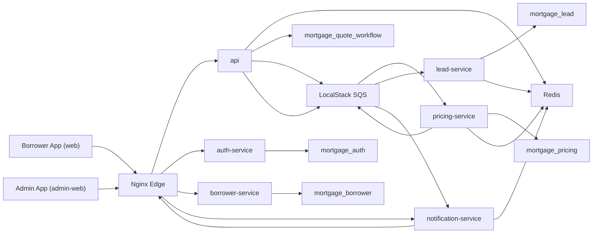

# Architecture

Harbor Loan Quotes is an event-driven mortgage quote and lead-generation platform built as a set of independently-deployable Spring Boot services behind an Nginx edge, with two React frontends (a borrower-facing app and an admin app).

This document expands on the high-level overview in the [README](../README.md).

## System diagram

## Design principles

- **Service-per-domain.** Each service owns one business capability and one database schema. No service reads another service's tables — all cross-service data flows over HTTP (sync) or SQS (async).
- **Async by default for expensive work.** Pricing, lead creation, and notifications are decoupled from the request path so the borrower's quote request returns immediately while work completes in the background.
- **Read models for fast reads.** `api` maintains a quote read model and `notification-service` keeps a Redis snapshot, so status checks never block on downstream workers.
- **Hardened message contracts.** Every async payload is versioned and idempotent, with dead-letter queues and replay tooling for poison messages.
- **Pluggable auth.** User authentication runs in either a self-issued JWT mode or an OIDC (Keycloak) mode without code changes.

## Request flow (quote lifecycle)

1. An anonymous user requests a public mortgage quote.
2. `api` deduplicates repeated requests per session and persists quote state in `mortgage_quote_workflow`.
3. `api` publishes a pricing job to SQS and returns a `quoteId` immediately.
4. `pricing-service` prices the scenario against its own persisted product catalog and publishes a result event.
5. `api` consumes the pricing result and updates the quote read model.
6. If an authenticated user refines the quote, `lead-service` creates a lead asynchronously and publishes a lead result event.
7. `notification-service` stores the latest snapshot and pushes updates to the frontend over SSE.
8. `admin-web` reads aggregated metrics through `api`.

## Service responsibilities

| Service | Owns | Store |
|---|---|---|
| `api` | Public quote creation/retrieval, refinement orchestration, calculators, session dedupe, metrics aggregation, notification publishing, service-JWT issuance | `mortgage_quote_workflow` |
| `auth-service` | Registration, login, access-token issuance, internal JWT mode | `mortgage_auth` |
| `borrower-service` | Borrower creation/retrieval, existence checks, borrower metrics | `mortgage_borrower` |
| `pricing-service` | Pricing job consumption, pricing catalog (products, rate sheets, adjustment rules), Redis pricing cache, lead-job publishing | `mortgage_pricing` |
| `lead-service` | Lead creation from refined quotes, lead metrics | `mortgage_lead` |
| `notification-service` | Quote snapshot cache, snapshot fetch endpoint, quote SSE stream | Redis only |

## Database ownership

Each service owns its schema; there is no cross-service table access.

- `auth-service` → `mortgage_auth`
- `borrower-service` → `mortgage_borrower`
- `api` → `mortgage_quote_workflow`
- `pricing-service` → `mortgage_pricing`
- `lead-service` → `mortgage_lead`
- `notification-service` → Redis only

## Messaging topology

SQS queues (emulated locally via LocalStack):

| Work queue | Result queue | Dead-letter queue |
|---|---|---|
| `quote-pricing-requests` | `quote-pricing-results` | `quote-pricing-results-dlq` |
| `quote-lead-requests` | `quote-lead-results` | `quote-lead-results-dlq` |
| `quote-notification-events` | — | `quote-notification-events-dlq` |

**Contract hardening.** Every async payload carries `schemaVersion` and `messageId`. Consumers reject unsupported schema versions, dedupe deliveries on `messageId`, and route poison messages to the matching DLQ. See the [operations runbook](./ops-runbook.md) for inspect/replay procedures.

## Security model

**User authentication** — two interchangeable modes for protected endpoints in `api` and `borrower-service`:

- `internal`: `auth-service` issues HMAC-signed JWTs.
- `oidc`: local Keycloak issues OIDC access tokens validated against a configured JWK set URI.

**Service-to-service authentication** — internal calls use service JWTs validated on issuer, audience, scope, and type. Examples: `api → borrower-service`, `api → pricing-service` (job token), `pricing-service → lead-service` (job token), `api → notification-service` (job token).

## Session tracking & deduplication

The borrower frontend generates and persists a session ID, sent as `X-Session-Id`. `api` uses Redis to track active sessions, detect in-flight duplicate quote requests, return the existing `quoteId` when a duplicate is already `QUEUED`/`PROCESSING`, and maintain fast status snapshots for the async flow.

## Technology choices

- **Java 17 / Spring Boot** for all backend services
- **MySQL** for per-service relational persistence
- **Redis** for session state, dedupe, caching, metrics counters, and notification snapshots
- **SQS (LocalStack locally)** for async messaging with DLQs
- **Keycloak** for the optional OIDC profile
- **React + Vite** for the borrower and admin apps
- **Nginx** as the public edge reverse proxy (HTTP `8088`, TLS `8443`)
- **Docker Compose** for local orchestration; **Jenkins** for CI

## Design history

The system was built incrementally and every significant decision is captured as an Architecture Decision Record under [`docs/adr`](./adr), organized by phase (foundation → pricing engine → scale & operations).
