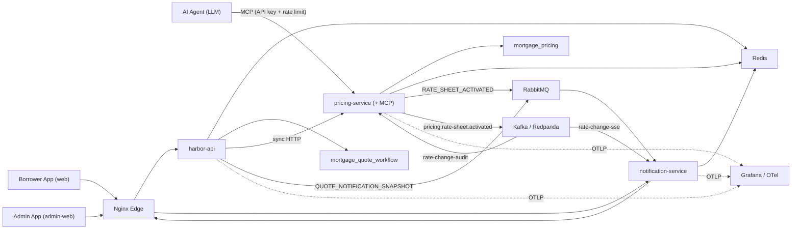

# Architecture

Harbor Loan Quotes is a mortgage quote and lead-generation platform built as a set of independently-deployable Spring Boot services behind an Nginx edge, with two React frontends (a borrower-facing app and an admin app).

This document expands on the high-level overview in the [README](../README.md).

> **Implementation status.** The synchronous paths (quote creation/retrieval, calculators, auth, borrower APIs, lead capture, metrics, admin) run in harbor-api. **RabbitMQ** carries work-queue messaging (default transport in Docker Compose). A **Kafka/Redpanda event stream** carries rate-change fan-out to independent audit + SSE consumers ([ADR-0052](./adr/phase-2-pricing-engine/0052-kafka-rate-change-event-stream.md)). `pricing-service` exposes its engine to **AI agents over MCP** ([ADR-0051](./adr/phase-4-ai-integration/0051-expose-pricing-via-mcp.md), [ADR-0053](./adr/phase-4-ai-integration/0053-secure-and-rate-limit-the-mcp-boundary.md)). Services are instrumented with **OpenTelemetry → Grafana** ([ADR-0030](./adr/phase-3-scale-and-operations/0030-observability-strategy.md)), and the full stack deploys to **Oracle Cloud behind a Cloudflare Tunnel** ([ADR-0055](./adr/phase-3-scale-and-operations/0055-oracle-cloud-cloudflare-tunnel-deployment.md)).

## System diagram

## Design principles

- **Service-per-domain.** Each service owns one business capability and one database schema. No service reads another service's tables — cross-service data flows over HTTP (sync) or a message broker (async).
- **Lead capture in-process.** Lead creation from a refined quote runs synchronously inside harbor-api. No lead queues exist. (ADR-0003)
- **Synchronous quote pricing.** harbor-api calls pricing-service over HTTP. Pricing is fast and consistent; async indirection for pricing adds latency without benefit at this scale. (ADR-0003)
- **Async for notifications and rate-sheet events.** Notification snapshot delivery and rate-sheet-activated fan-out are decoupled through RabbitMQ so the quote request path returns immediately and the frontend receives SSE updates asynchronously.
- **Read models for fast reads.** `harbor-api` maintains a quote read model and `notification-service` keeps a Redis snapshot, so status checks never block on downstream workers.
- **Broker-agnostic transport.** Async messaging is built against a single transport interface with swappable adapters (NoOp / RabbitMQ / SQS), so the broker is a config choice rather than a code dependency ([ADR-0007](./adr/phase-1-foundation/0007-messaging-transport-abstraction.md)). Message contracts carry `schemaVersion` and `messageId` for versioned, idempotent delivery.
- **Pluggable auth.** User authentication runs in either a self-issued JWT mode or an OIDC (Keycloak) mode without code changes.

## Request flow (quote lifecycle)

1. An anonymous user requests a public mortgage quote. *(implemented)*
2. `harbor-api` deduplicates repeated requests per session and persists quote state in `mortgage_quote_workflow`. *(implemented)*
3. `harbor-api` calls `pricing-service` synchronously over HTTP; `pricing-service` prices the scenario against its persisted product catalog and returns a result. *(implemented)*
4. `harbor-api` updates the quote read model with the pricing result. *(implemented)*
5. If an authenticated user refines the quote, `harbor-api` creates the lead in-process. *(implemented — in-process, no async round-trip)*
6. `harbor-api` publishes a `QUOTE_NOTIFICATION_SNAPSHOT` event to the `quote.notification.events` RabbitMQ exchange. *(implemented)*
7. `notification-service` consumes from queue `quote.notification.snapshot`, stores the latest snapshot in Redis, and pushes an SSE update to the frontend. *(implemented)*
8. `admin-web` reads aggregated metrics through `harbor-api`. *(implemented)*

## Service responsibilities

| Service | Owns | Store |
|---|---|---|
| `harbor-api` (`api`) | Public quote creation/retrieval, refinement orchestration, calculators, session dedupe, metrics aggregation, notification publishing, service-JWT issuance; auth (registration, login, token issuance); borrower creation/retrieval/metrics; lead creation/metrics | `mortgage_quote_workflow` (auth/borrower/lead/quote tables) |
| `pricing-service` | Synchronous quote pricing (called by harbor-api over HTTP), pricing catalog (products, rate sheets, adjustment rules), Redis pricing cache, rate-sheet-activated publishing to RabbitMQ + Kafka, the `rate-change-audit` Kafka consumer, and the **MCP server** (tool adapters + API-key/rate-limit gateway) | `mortgage_pricing` |
| `notification-service` | Quote notification snapshot consumption, rate-sheet-activated consumption (RabbitMQ or the `rate-change-sse` Kafka group), Redis snapshot cache, snapshot fetch endpoint, SSE stream | Redis only |

## Database ownership

Each service owns its schema; there is no cross-service table access.

- `harbor-api` → `mortgage_quote_workflow` (contains auth, borrower, lead, and quote tables)
- `pricing-service` → `mortgage_pricing`
- `notification-service` → Redis only

## Messaging

Async messaging is built against a **broker-agnostic transport abstraction** ([ADR-0007](./adr/phase-1-foundation/0007-messaging-transport-abstraction.md)): a `MessageTransport` interface selected by `app.transport.type`, with adapters for:

- `noop` — no messages published; async layer inert (used in test environments)
- `rabbitmq` — **active default** in Docker Compose; the local Phase-2 broker ([ADR-0050](./adr/phase-2-pricing-engine/0050-message-broker-selection.md))
- `sqs` — Phase-3 target; LocalStack emulates SQS locally behind the `integration` profile

### Active RabbitMQ topology

**Flow A — Quote notifications** (harbor-api → notification-service):

| Component | Name |
|---|---|
| Exchange | `quote.notification.events` (topic, durable) |
| Routing key | `QUOTE_NOTIFICATION_SNAPSHOT` |
| Queue | `quote.notification.snapshot` (durable) |

**Flow B — Rate-sheet activation** (pricing-service → notification-service):

| Component | Name |
|---|---|
| Exchange | `rate-sheet.events` (topic, durable) |
| Routing key | `RATE_SHEET_ACTIVATED` |
| Queue | `rate-sheet.activated` (durable) |

harbor-api declares the `quote.notification.events` exchange and publishes only. notification-service declares all exchanges, queues, and bindings for both flows. pricing-service declares the `rate-sheet.events` exchange independently; AMQP is idempotent on re-declaration of matching durable exchanges.

### Kafka event stream (rate change)

Separate from the RabbitMQ work queues, a **Kafka/Redpanda event stream** carries rate-sheet activations to multiple independent consumer groups that need retention and replay ([ADR-0052](./adr/phase-2-pricing-engine/0052-kafka-rate-change-event-stream.md)). This is *not* a `MessageTransport` adapter — it is an additive channel for a fan-out/replay pattern the work-queue broker doesn't fit.

| Component | Name |
|---|---|
| Topic | `pricing.rate-sheet.activated` (keyed by `investorId` for per-investor ordering) |
| Consumer group | `rate-change-audit` (pricing-service) → `rate_change_audit` table; `auto-offset-reset: earliest` (full replay) |
| Consumer group | `rate-change-sse` (notification-service) → SSE broadcast; `auto-offset-reset: latest` (live only) |

Consumers are idempotent (unique `rate_sheet_id` + a race guard), so at-least-once redelivery and offset replay are safe. Cache invalidation stays synchronous at the write site (shared Redis) rather than becoming a third consumer. A transactional outbox is the noted next step for the publish-inside-transaction dual-write.

### Contract hardening

Each payload carries `schemaVersion` and `messageId`. Consumers reject unsupported schema versions, dedupe on `messageId`, and route poison messages to DLQs. The LocalStack-SQS DLQ tooling is described in the [operations runbook](./ops-runbook.md).

### Lead queues removed
Lead processing was consolidated in-process inside harbor-api (ADR-0003). The `quote-lead-requests` and `quote-lead-results` queues no longer exist.

## Security model

**User authentication** — two interchangeable modes for protected endpoints in `harbor-api`:

- `internal`: harbor-api issues HMAC-signed JWTs.
- `oidc`: local Keycloak issues OIDC access tokens validated against a configured JWK set URI.

**Service-to-service authentication** — internal calls use service JWTs validated on issuer, audience, scope, and type. Examples: `harbor-api → pricing-service` (sync HTTP job token), `harbor-api → notification-service` (RabbitMQ message token, validated by the consumer).

## Session tracking & deduplication

The borrower frontend generates and persists a session ID, sent as `X-Session-Id`. `harbor-api` uses Redis to track active sessions, detect in-flight duplicate quote requests, return the existing `quoteId` when a duplicate is already `QUEUED`/`PROCESSING`, and maintain fast status snapshots.

## AI agent integration (MCP)

`pricing-service` runs a **Model Context Protocol** server (Spring AI) that exposes the pricing engine to LLM agents as discoverable, typed tools ([ADR-0051](./adr/phase-4-ai-integration/0051-expose-pricing-via-mcp.md)). Tools (`getRateQuote`, `listLoanPrograms`, `getLoanProgramDetails`) are thin `@Tool` adapters over the existing `QuotePricingService` — no pricing logic is reimplemented, and each returns a dedicated record so the agent contract is decoupled from JPA entities. Transport is SSE over Spring MVC (`GET /sse`, `POST /mcp/message`).

The agent boundary is secured independently of the internal service-token flow ([ADR-0053](./adr/phase-4-ai-integration/0053-secure-and-rate-limit-the-mcp-boundary.md)): a servlet filter scoped to `/sse` + `/mcp/**` enforces API-key auth then a per-key Bucket4j token bucket, both *before* a request reaches the DB or cache. A provider-agnostic client ([`mcp-client-demo`](../mcp-client-demo), [ADR-0054](./adr/phase-4-ai-integration/0054-mcp-client-agent-demo.md)) drives it over the OpenAI Chat Completions standard, so any compatible model works by config.

## Observability

All services are instrumented with **Micrometer Tracing → OpenTelemetry**, exported over OTLP to a Grafana stack (Tempo/Loki/Prometheus via one `otel-lgtm` container) ([ADR-0030](./adr/phase-3-scale-and-operations/0030-observability-strategy.md)). Application code emits a vendor-neutral standard; the backend is swappable by config. Trace context propagates across the Kafka boundary via message headers, so a rate-sheet activation is a single trace spanning HTTP → JDBC → Kafka producer → audit consumer, and into notification-service's SSE consumer under the same trace id.

## Deployment

The full stack deploys to a single **Oracle Cloud Always-Free Ampere (ARM)** instance via Docker Compose, exposed through an outbound **Cloudflare Tunnel** ([ADR-0055](./adr/phase-3-scale-and-operations/0055-oracle-cloud-cloudflare-tunnel-deployment.md)). No inbound ports are opened (the OCI security list stays closed); Cloudflare terminates TLS and forwards to an internal nginx edge (web/api/admin) and to `pricing-service` for the MCP endpoint. A `docker-compose.prod.yml` override layers the tunnel and prod config onto the base compose; see the [deploy runbook](./deploy/oracle-cloud-runbook.md). AWS remains the documented managed-scale path ([ADR-0028](./adr/phase-3-scale-and-operations/0028-aws-migration-strategy.md)).

## Technology choices

- **Java 17/21 / Spring Boot** for all backend services; **Spring AI** for the MCP server
- **MySQL** for per-service relational persistence
- **Redis** for session state, dedupe, caching, metrics counters, and notification snapshots
- **RabbitMQ** for work queues (broker-agnostic transport; SQS is the Phase-3 adapter) + **Kafka/Redpanda** for the rate-change event stream
- **OpenTelemetry + Grafana** (Tempo/Loki/Prometheus) for tracing/metrics/logs
- **Bucket4j** for MCP rate limiting; **Keycloak** for the optional OIDC profile
- **React + Vite** for the borrower and admin apps
- **Nginx** as the edge reverse proxy; **Cloudflare Tunnel** for public ingress in production
- **Docker Compose** for orchestration (local + Oracle Cloud); **Jenkins** for CI; **Testcontainers** for integration tests

## Design history

The system was built incrementally and every significant decision is captured as an Architecture Decision Record under [`docs/adr`](./adr), organized by phase (foundation → pricing engine → scale & operations → AI agent integration).
